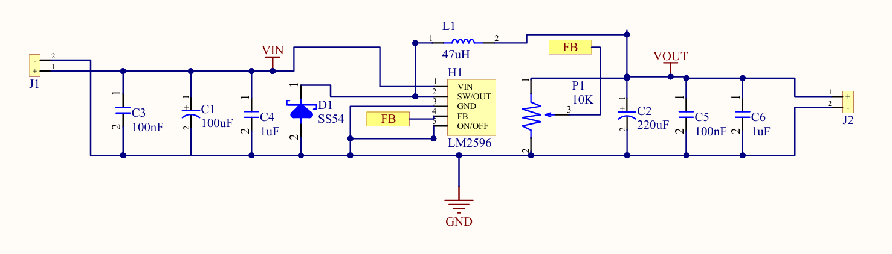
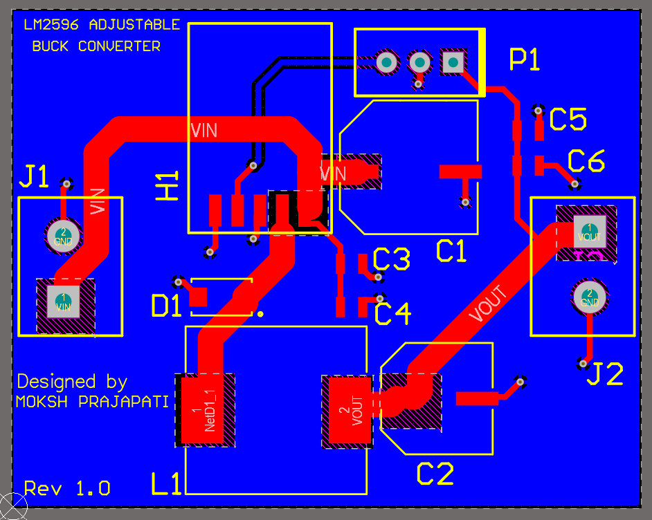
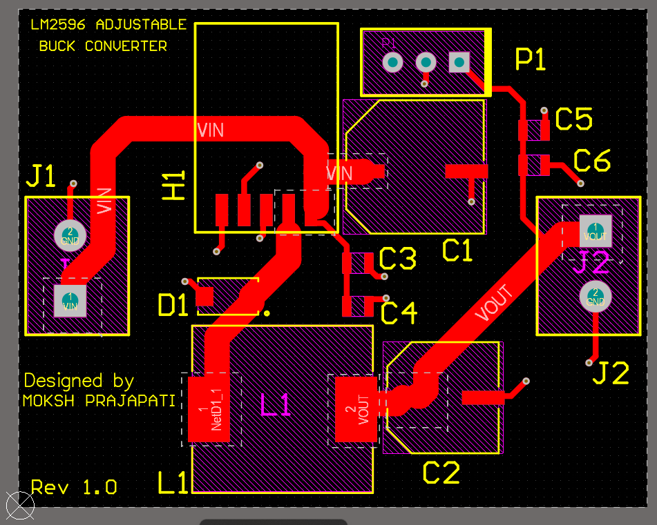
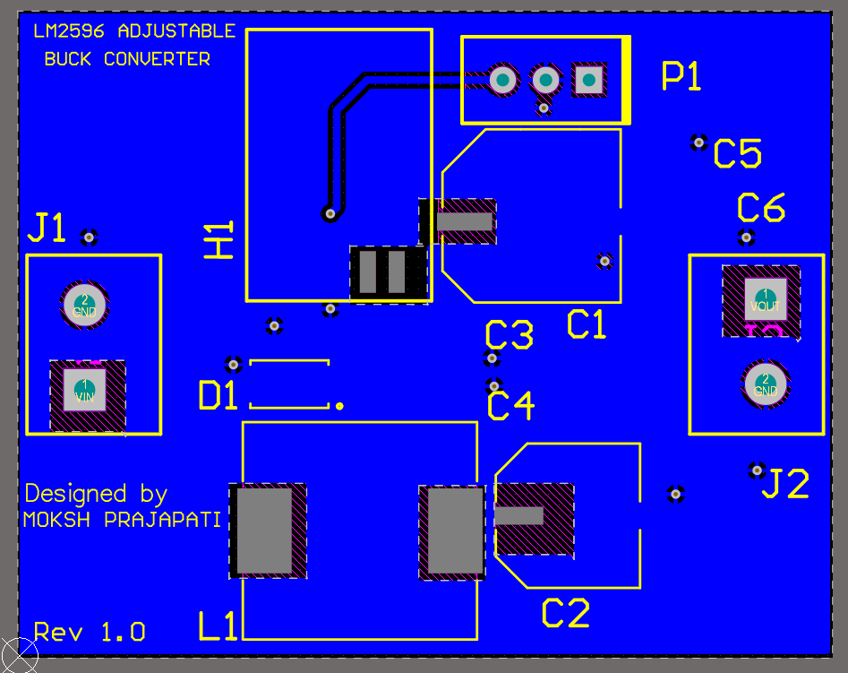
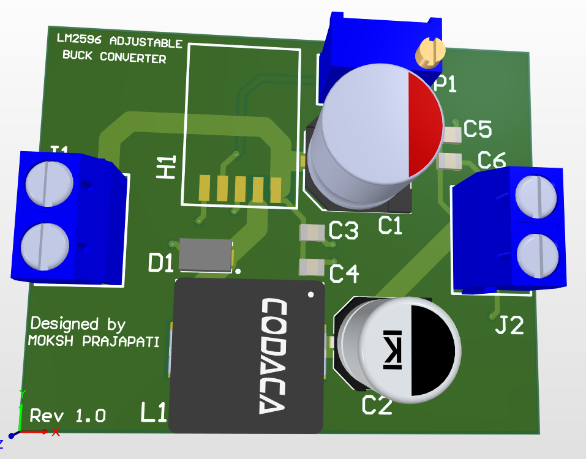
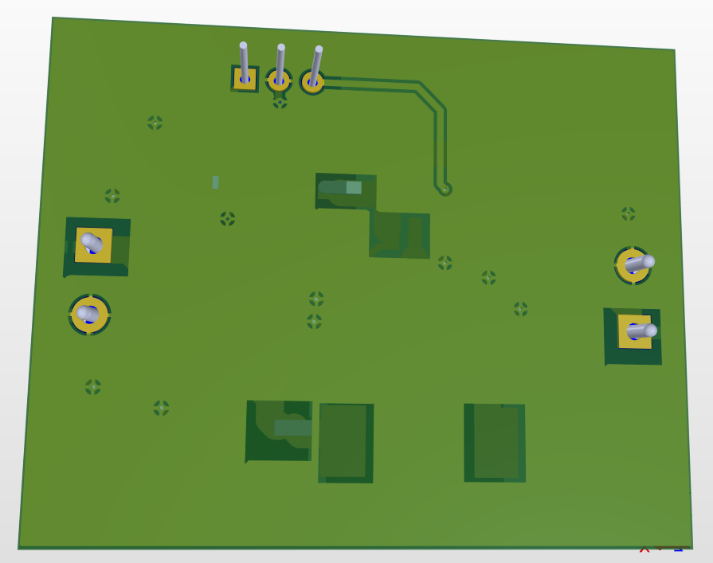

# LM2596 Adjustable Buck Converter PCB Design

A 2-layer LM2596-based adjustable DC-DC buck converter PCB designed in Altium Designer 25.1. This project includes custom schematic symbols, custom PCB footprints, ERC/DRC verification, BOM generation, and manufacturing-ready outputs.

---

## Project Overview

This project implements an adjustable DC-DC buck converter using the LM2596 switching regulator IC. The PCB efficiently converts a higher DC input voltage into a regulated lower DC output voltage while minimizing power loss and heat generation.

The schematic was developed by studying the LM2596 datasheet and application circuit, followed by complete PCB implementation, verification, and manufacturing preparation in Altium Designer.

---

## Key Features

* LM2596 Adjustable Switching Regulator
* 2-Layer PCB Design
* Custom Schematic Symbols
* Custom PCB Footprints
* Wide High-Current Power Traces
* Bottom Layer GND Copper Pour
* ERC Verification
* DRC Verification
* BOM Generation
* Gerber Generation
* Manufacturing-Ready Outputs
* 3D PCB Verification

---

## Project Images

### Schematic

---

### PCB Layout

---

### Top Layer

---

### Bottom Layer

---

### 3D Top View

---

### 3D Bottom View

---

## Main Components

| Designator | Component                        |
| ---------- | -------------------------------- |
| U1         | LM2596 Adjustable Buck Regulator |
| D1         | SS54 Schottky Diode              |
| L1         | 47 µH Inductor                   |
| RV1        | 10 kΩ Potentiometer              |
| C1         | 100 µF Input Capacitor           |
| C2         | 220 µF Output Capacitor          |
| C3, C5     | 100 nF Ceramic Capacitors        |
| C4, C6     | 1 µF Ceramic Capacitors          |
| J1         | Input Terminal Block             |
| J2         | Output Terminal Block            |

---

## Working Principle

The LM2596 operates as a switching regulator.

1. Input DC power enters through the input connector.
2. Input capacitors filter supply ripple and noise.
3. The LM2596 switches the input voltage at high frequency.
4. The inductor stores and transfers energy.
5. The SS54 Schottky diode provides the freewheeling current path.
6. Output capacitors smooth the output voltage.
7. The potentiometer adjusts the output voltage through the feedback network.

This switching topology provides significantly higher efficiency than traditional linear regulators.

---

## PCB Design Highlights

### Component Placement Strategy

Components were arranged according to power flow:

Input Connector → Input Filter → LM2596 → Inductor/Diode → Output Filter → Output Connector

### Routing Considerations

* Wide traces used for high-current paths
* Reduced voltage drop
* Improved current carrying capability
* Logical functional grouping
* Short power routing paths

### Grounding Strategy

* Bottom-layer GND copper pour
* Improved return current paths
* Reduced ground impedance
* Better PCB manufacturability

---

## Design Verification

### ERC Verification

* ERC Completed Successfully
* No critical schematic connectivity issues detected

### DRC Verification

Final DRC Status:

* Clearance Violations = 0
* Width Violations = 0
* Unrouted Nets = 0
* Total DRC Errors = 0

The PCB successfully passed design verification checks before manufacturing output generation.

---

## Manufacturing Outputs

This repository includes:

* Gerber Files
* NC Drill Files
* BOM
* ERC Report
* DRC Report
* PCB Source Files
* Custom Libraries

---

## Custom Libraries

Custom libraries were created and verified during the project.

### Custom Schematic Library

* LM2596 Symbol
* Supporting Components

### Custom PCB Library

* LM2596 Footprint
* Power Components
* Passive Components
* Connectors

---

## Files Included

### Design Files

* Schematic Document (.SchDoc)
* PCB Layout (.PcbDoc)
* Project File (.PrjPcb)

### Libraries

* Schematic Library (.SchLib)
* PCB Library (.PcbLib)

### Reports

* ERC Report
* DRC Report

### Manufacturing Files

* Gerber Outputs
* Drill Files

### Documentation

* BOM
* PCB Images
* 3D Views

---

## Skills Demonstrated

* PCB Design
* Power Electronics PCB Layout
* Altium Designer 25.1
* Custom Symbol Creation
* Custom Footprint Creation
* Datasheet Interpretation
* High-Current Routing
* Ground Plane Design
* ERC Verification
* DRC Verification
* BOM Generation
* Gerber Generation
* Manufacturing Documentation

---

## Software Used

* Altium Designer 25.1

---

## Author

**Moksh Prajapati**

Electronics Engineering Student
PCB Design Engineer Aspirant

GitHub: https://github.com/moksh-pcb-design
